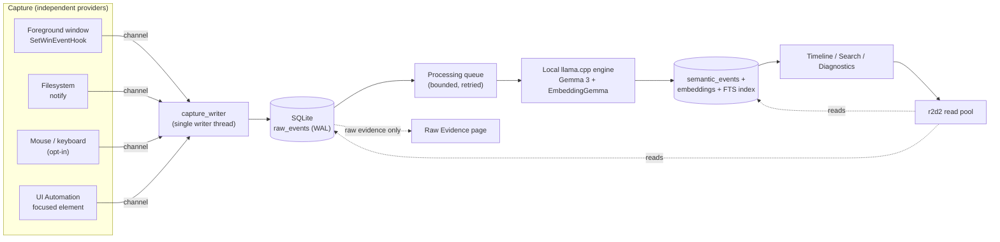
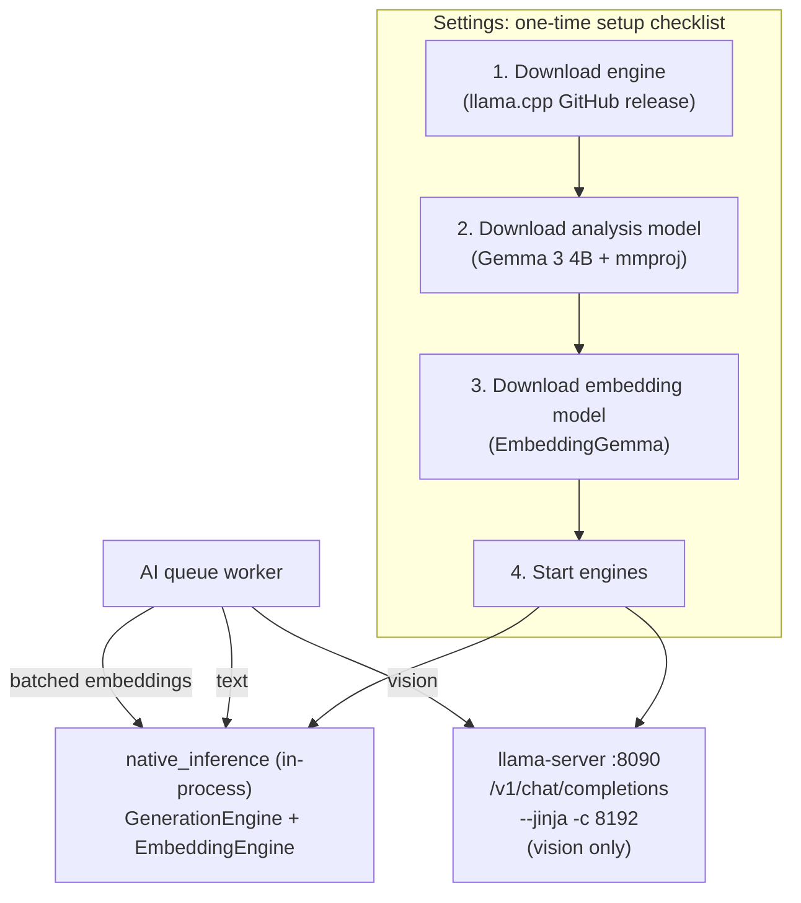

# Chronicle

Chronicle is a Windows-first, local-first computer memory engine. It watches your activity — foreground apps, window titles, filesystem changes, and (opt-in) mouse clicks, keyboard metadata, and screenshots — and persists it as raw evidence on your own machine before any AI touches it. A local LLM turns that evidence into searchable semantic insights; Timeline and Search show only the processed insights, never the raw capture stream.

Everything runs on-device. No cloud processing, no telemetry, no external service in the loop.

Chronicle ships as a single standalone binary — no installer, no code-signing/notarization, distributed the way Postgres or Redis are. See [Installation](#installation) to run it.

## Architecture

Chronicle is one long-running process: capture, SQLite persistence, local LLM inference, and an embedded HTTP server all live in the same binary. The server serves a JSON API and the built React frontend on `127.0.0.1`; the binary opens that URL in your default browser on launch, and everything keeps running whether or not the tab stays open. There's no native app shell and no installer step — this is what makes distribution unsigned-and-unnotarized-friendly (see [Installation](#installation)).

Capture and AI processing are decoupled — a slow or unavailable model never blocks persistence, and a busy database never stalls an input hook.



Raw events are append-only evidence. Semantic events reference their source raw event and can be regenerated when models change; deleting or reprocessing semantic data never touches the raw record it came from. Only context-bearing events — window/app focus changes and filesystem activity — are queued for AI analysis; mouse and keyboard activity is recorded for Raw Evidence but never reaches the model. Screenshots are captured once, at the moment a window gains focus, held in a small in-memory cache, and released after processing — never re-captured later, never written to disk.

### Local AI engine

Local inference runs on [llama.cpp](https://github.com/ggml-org/llama.cpp), bundled — no separate install, tray icon, or Start Menu entry for it. Text analysis and embeddings run **in-process** via native `llama-cpp-2` Rust bindings (direct control over model/context lifecycle and memory, not an HTTP call to a separately spawned server); a bundled `llama-server` is still spawned for vision (screenshot) analysis, which hasn't been ported to the native path yet.



Text analysis batches up to 8 events per numbered prompt with an index-checked response; embeddings batch natively by packing every input into one context as its own sequence. The vision `llama-server` speaks llama.cpp's OpenAI-compatible API on `127.0.0.1`, overridable via `CHRONICLE_LLAMA_HOST` / `CHRONICLE_LLAMA_CHAT_PORT` / `CHRONICLE_LLAMA_EMBED_PORT`, and is launched only if its files are present and it isn't already listening. Capture and persistence work fully with none of this set up — the AI queue simply retries until setup completes.

Model downloads and the data-directory move are the two long-running operations in the app; since there's no push channel to the browser, both run fire-and-forget on a background task and report progress through a polled `GET /api/local-ai/progress` / `GET /api/data-directory/move-progress` endpoint instead of a blocking response.

Native JSON output currently relies on prompt instructions plus response validation/retry, not grammar-constrained decoding (a hand-written GBNF grammar crashed this llama.cpp build's grammar engine outright and was reverted rather than shipped) — a known gap tracked for a schema-driven grammar follow-up.

**Resource-aware scheduling** (`hardware_profiler` + `memory_planner`): every model load is checked against real, current available RAM (`GlobalMemoryStatusEx`) before it happens — context size steps down through a ladder (8192 → 4096 → 2048 → 1024) until a size is found that fits with headroom to spare, and a load is refused outright rather than risking an OOM if nothing fits. Per-request context size also scales with what the prompt actually needs (a single short event vs. an 8-item batch) instead of always requesting the maximum. Batch size scales the same way against available memory (`adaptive_batch_size`). None of this touches GPU sizing yet — the bundled engine is CPU-only, so GPU is always reported absent rather than guessed at.

**Model lifecycle**: the two engines have different residency policies. `EmbeddingEngine` stays resident once loaded — it's small and called on every processed event. `GenerationEngine` (the multi-gigabyte chat/vision model) unloads after 60s of inactivity (`GENERATION_KEEP_ALIVE`), checked on every idle tick of the AI worker's poll loop, and transparently reloads (with a larger context if a new request needs more than the last load had) on the next request — trading a small reload cost for not holding gigabytes of RAM during the long stretches between capture events. `GET /api/inference/telemetry` exposes the current hardware snapshot, the generation engine's residency state (`unloaded`/`ready`/`idle`), and the batch size that would currently be chosen.

## Privacy

- Foreground, mouse/keyboard metadata, and screen capture are each independently opt-in; screen capture is off by default.
- Keyboard capture stores metadata only by default; text capture, where enabled, is restricted to an explicit per-application allowlist.
- Application/path exclusions match on exact executable name and path-component containment (not raw substring), applied before persistence.
- Watched folders record file metadata only, never file contents.
- Export produces local JSON; delete-all permanently removes raw, semantic, embedding, and queue records after confirmation.
- Diagnostics reports permissions, exclusions, storage, queue state, and provider availability.

## Performance

- Mouse capture is click/scroll only — movement is never recorded or analyzed.
- SQLite runs WAL with `synchronous=NORMAL`, indexed hot paths, and a `busy_timeout`.
- The AI worker batches, paces between batches, and steps aside while you're actively typing/clicking, so local inference doesn't compete with active use.
- The local engine client reuses keep-alive HTTP connections and bounds generation length (`max_tokens`) so one bad response can't stall the queue.
- `processing_metrics` (completed/failed/panicked counts, average latency) is queryable live, separate from raw queue counts.
- Model load/context size, batch size, and the generation model's residency all adapt to currently available RAM instead of using fixed values (see "Resource-aware scheduling" above).

## Known limitations

- GPU acceleration isn't automatic — model weights always load with 0 GPU layers (CPU only).
- Vision (screenshot) analysis still goes through the HTTP `llama-server`, not the native path — text and embeddings do.
- Native JSON output has no grammar constraint (see "Local AI engine" above); relies on prompt instructions and response validation/retry.
- The embedding model always stays resident once loaded (by design — see "Model lifecycle" above); only the generation model idle-unloads.
- No model-swap/version-upgrade path; replacing a model means removing it and downloading a replacement by hand.
- Elevated apps, UAC/secure-desktop input, and antivirus interaction are untested.
- Raw-event search does not currently filter by query (see `Database::recent_events`).
- `scripts/release-smoke.ps1` and `scripts/windows-runtime-smoke.ps1` still reference the old Tauri/NSIS packaging flow and need updating for the daemon-binary build (`npm run build:release`) — not yet done.
- Capture (foreground window hooks, UI Automation, mouse/keyboard) is still Windows-only; the daemon/HTTP distribution model works cross-platform, but non-Windows capture backends don't exist yet.

## Installation

Chronicle is a single executable — install it, run it, and it opens in your browser. There's no installer, no admin prompt, and no code-signing/notarization step, so your OS will flag it as an unrecognized binary the first time; that's expected for an unsigned indie tool and safe to bypass.

### One-line install (PowerShell)

```powershell
irm https://raw.githubusercontent.com/anadi45/chronicle/main/scripts/install.ps1 | iex
```

This downloads the latest release binary from [GitHub Releases](https://github.com/anadi45/chronicle/releases) (built and published automatically by `.github/workflows/release.yml` on every `vX.Y.Z` tag), installs it to `%LOCALAPPDATA%\Chronicle\chronicle.exe`, and adds that folder to your user `PATH`. Open a **new** terminal afterward and run:

```powershell
chronicle
```

To install a specific version instead of latest, download the script first and pass `-Version`:

```powershell
irm https://raw.githubusercontent.com/anadi45/chronicle/main/scripts/install.ps1 -OutFile install.ps1
.\install.ps1 -Version v1.2.3
```

### Manual install

Prefer not to run someone's install script? Download the binary yourself:

1. Grab `chronicle-windows-x86_64.exe` from the [latest release](https://github.com/anadi45/chronicle/releases/latest).
2. Run it from a terminal or by double-clicking it:
   ```powershell
   .\chronicle-windows-x86_64.exe
   ```

### After installing

- Windows SmartScreen will likely show "Windows protected your PC" on first run — click **More info → Run anyway**. This is a reputation warning, not a malware detection; it goes away over time as more people run the same binary, and can be skipped entirely by building from source yourself (see [Development](#development)).
- Your default browser opens automatically to `http://127.0.0.1:47823` (override the port with the `CHRONICLE_PORT` environment variable, e.g. `$env:CHRONICLE_PORT=8123; chronicle`; skip the auto-open with `CHRONICLE_NO_OPEN=1`). Capture and local AI setup are configured from the **Settings** page inside the app.
- Chronicle keeps running in that terminal/background process as long as you want capture active — closing the browser tab does not stop it. Stop it with Ctrl+C in the terminal it's running in (or Task Manager if launched detached); this cleanly stops capture and any running local-model engine processes before exiting.
- Chronicle stores everything — the event database and downloaded models — in a data directory you choose on first run from **Settings**. Nothing is written anywhere before you choose one; until then it runs in a temporary, non-persistent mode.

## Development

Building the Rust backend compiles llama.cpp from source (for the native inference bindings), which needs **CMake** and **LLVM/libclang** (for `bindgen`) on `PATH`, in addition to the MSVC Build Tools:

```powershell
winget install --id Kitware.CMake -e
winget install --id LLVM.LLVM -e
```

```powershell
npm install
npm run build
npm test
npm run test:frontend
npm run dev
```

`npm run dev` runs the Rust backend (`cargo run`) and the Vite dev server side by side — Vite serves the frontend on `http://localhost:1420` with hot reload and proxies `/api/*` to the backend, which binds its own port (`CHRONICLE_PORT`, default `47823`) and does **not** auto-open a browser tab for you in this mode; open `localhost:1420` yourself. Run only the backend with `npm run dev:backend`, or only the frontend with `npm run dev:vite`.

`npm test` runs the Rust test suite (schema, ordering, FTS, retries, queue, end-to-end processing). `npm run test:frontend` type-checks the frontend. Capture workers auto-restart on launch if capture was previously enabled.

To build the single distributable binary (frontend compiled to static assets and embedded into the Rust binary at compile time — see `src-tauri/src/lib.rs`'s `FrontendAssets`):

```powershell
npm run build:release
```

This produces `src-tauri/target/release/chronicle.exe`. Because the frontend is embedded at *compile* time, always run `npm run build` (or `build:release`, which does it for you) before a release `cargo build` — a stale `dist/` gets baked in otherwise.

Additional scripts:

| Script | Purpose |
| --- | --- |
| `scripts/windows-capture-acceptance.ps1` | Launches Notepad and verifies foreground events reach SQLite (requires Python 3) |
| `scripts/benchmark.ps1` | Persistence, search, queue, and frontend timing baselines |

### Startup troubleshooting

If the binary logs `failed to bind — is another Chronicle instance already running?` and exits, another Chronicle process (or something else) already owns that port — stop it, or set `CHRONICLE_PORT` to a free one. If the browser doesn't open automatically, check the terminal for the `Chronicle is running at http://127.0.0.1:PORT` log line and open that URL by hand.
